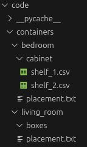

A simple program for managing my home's inventory. It uses web UI via Flask.  
Justification: I want to know in which containers (boxes, shelves, etc.) I store my items and my memory is not good enough.

Containers directory is not included(gitignore) in this project for privacy  
Example structure:

  
\> containers
- bedroom
    - cabinet
        - shelf_1.csv
        - shelf_2.csv
- living_room
    - boxes
        - art.csv
        - pc_components.csv
- kitchen
    - cabinet_1
        - shelf_1.csv
        - shelf_2.csv
    - cabinet_2
        - shelf_1.csv
        - shelf_2.csv